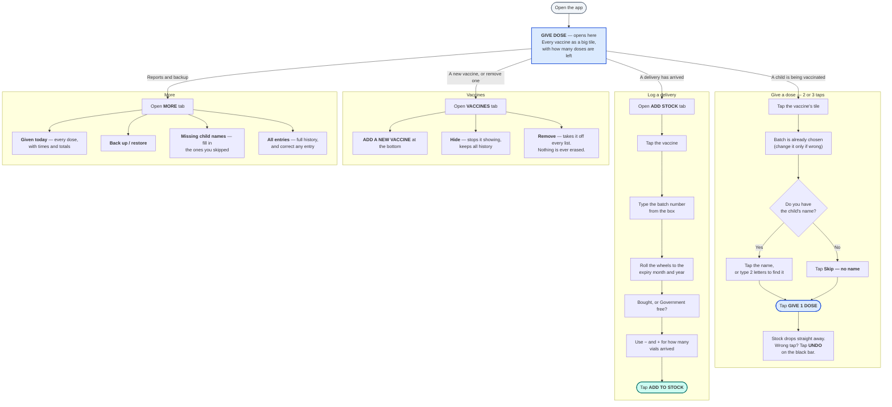

# Clinic Stock — how to use it

A replacement for the vaccine stock notebook. Everything stays on the phone; no internet is needed
to use it.

Two things happen all day, and both are on the first two tabs.

---

## The whole app in one picture

---

## Installing it

1. Tap the link sent on WhatsApp. Let it download.
2. Android will warn that it is not from the Play Store. Choose **More details → Install anyway**.
   It asks once.
3. Open **Clinic Stock**.

## Before you rely on it — five minutes, once

1. Open the **VACCINES** tab and check **doses per vial** for every vial you actually use.
   These are only suggestions and pack sizes vary by manufacturer. **This number multiplies every
   count**, so a wrong one there makes every total wrong for that vaccine.
2. Open **ADD STOCK** and enter what is in the fridge right now, vaccine by vaccine.
3. Open **MORE → Back up / restore**, take one backup, and send it to yourself on WhatsApp — so you
   have seen it work once before you need it.

---

## The colours mean something

The tab you are on tells you which way stock is moving. **Give dose is blue and takes stock out.
Add stock is green-blue and puts stock in.** If the screen is the wrong colour, you are on the wrong
tab.

On the tiles:

| What you see | What it means |
| --- | --- |
| **18 doses** in black | Fine |
| **LOW** in amber | At or below the safety limit you set |
| **OUT** in red | None left |
| **CHECK** in red | The count went below zero — a delivery was probably not logged |

Every warning has a **word**, not only a colour.

---

## Things worth knowing

**The child's name is always optional.** Never let a missing name stop you recording a dose. Tap
**Skip — no name** and finish it later from **MORE → Missing child names**.

**Nothing is ever deleted.** Correcting an entry adds a correction next to it, so the history stays
complete. That is why **UNDO** stays available from **MORE → All entries** weeks later, not just for
the few seconds the black bar is on screen.

**A low-stock warning never blocks you.** The app will always let you record a vaccination.

**Type the batch number once per box, not once per child.** When you give a dose, the batch is
already filled in.

**Expiry is the end of the printed month.** A vial marked 03/2027 is usable through 31 March 2027,
and the app says so under the wheels.

---

## If something looks wrong

- **A number looks wrong** → **MORE → All entries** shows every entry in order. Tap
  **Correct this entry** on the wrong one. It is never too late.
- **A red message appears** → read it. It always says whether anything was saved. If it says
  *nothing was saved*, nothing was.
- **An amber bar asks you to back up** → tap **Back up**, or **Later** to be asked again tomorrow.
- **Anything else** → send a screenshot on WhatsApp. Also send a backup file if you can: it contains
  the whole picture.

---

## Backups — the one habit that matters

The phone holds the records. Back it up when the app asks.

**MORE → Back up / restore → Back up now** makes one file and offers to share it. Send it to yourself
on WhatsApp, or save it to Drive. It is small and takes seconds.

If the phone is ever lost or replaced, that file puts everything back.
