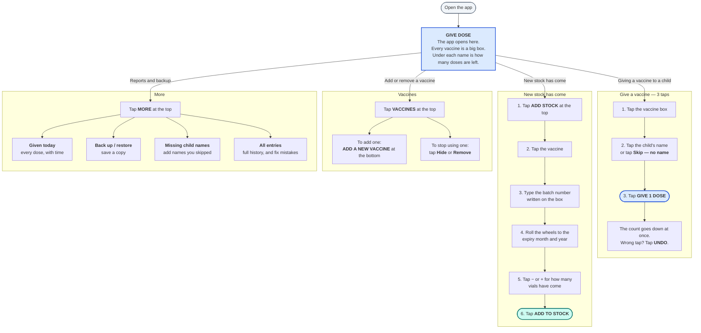

# Clinic Stock — how to use it

This app replaces the vaccine stock notebook.

Everything stays on the phone. No internet is needed.

There are 4 tabs at the top. You will use the first two every day.

---

## The app in one picture

---

## How to install it

1. Tap the link.
2. Let it download.
3. The phone will say it is not from the Play Store. Tap **More details**, then **Install anyway**.
4. Open **Clinic Stock**.

It asks only the first time.

---

## Do this once, before you start

**1. Check the doses per vial.**

Tap **VACCINES**. Look at each vial you use. Check that the doses per vial matches the real vial in
your fridge.

This number is used for every count. If it is wrong, every total for that vaccine will be wrong.

**2. Put in what you have now.**

Tap **ADD STOCK**. Add what is in the fridge today, one vaccine at a time.

**3. Take one backup.**

Tap **MORE**, then **Back up / restore**, then **Back up now**. Send the file to yourself on
WhatsApp. Now you have seen it work once.

---

## Giving a vaccine

1. Tap the vaccine box.
2. Tap the child's name. Or type 2 letters to find it. Or tap **Skip — no name**.
3. Tap **GIVE 1 DOSE**.

The count goes down at once.

If you tapped wrong, a black bar comes up at the bottom. Tap **UNDO** on it.

You do not have to type the batch. It is already filled in.

---

## When new stock comes

1. Tap **ADD STOCK** at the top.
2. Tap the vaccine.
3. Type the batch number from the box.
4. Roll the wheels to the expiry month and year.
5. Tap **Bought** or **Government (free)**.
6. Tap **−** or **+** for how many vials have come.
7. Tap **ADD TO STOCK**.

You do not have to multiply. The app does it.

---

## The colours

**Blue** takes stock out. **Green** puts stock in.

If the screen is the wrong colour, you are on the wrong tab.

| On the box | Meaning |
| --- | --- |
| **18 doses** in black | Fine |
| **LOW** in yellow | Very few left |
| **OUT** in red | None left |
| **CHECK** in red | The count went below zero. Some stock was not put in. |

Every warning has a word, not just a colour.

---

## Good to know

**The child's name is not needed.** Never stop because you do not have it. Tap **Skip — no name**.
Add it later from **MORE → Missing child names**.

**Nothing is ever deleted.** If you fix a mistake, the app adds a correction next to it. The old
entry stays. So you can fix a mistake weeks later.

**A LOW or OUT warning never stops you.** The app will always let you record a vaccine.

**Expiry means the end of that month.** A vial marked 03/2027 can be used until 31 March 2027. The
app writes the last date under the wheels.

---

## If something looks wrong

**A number looks wrong** — Tap **MORE**, then **All entries**. Every entry is there, newest first.
Tap **Correct this entry** on the wrong one.

**A red message comes up** — Read it. It always tells you if anything was saved. If it says nothing
was saved, then nothing was saved.

**A yellow bar asks you to back up** — Tap **Back up**. Or tap **Later** to be asked tomorrow.

**Anything else** — Send a photo of the screen on WhatsApp. Also send a backup file if you can.

---

## Backups

The records are on this phone. Back it up when the app asks.

Tap **MORE** → **Back up / restore** → **Back up now**.

It makes one small file. Send it to yourself on WhatsApp, or save it to Drive. It takes a few
seconds.

If the phone is lost or changed, that file puts everything back.
