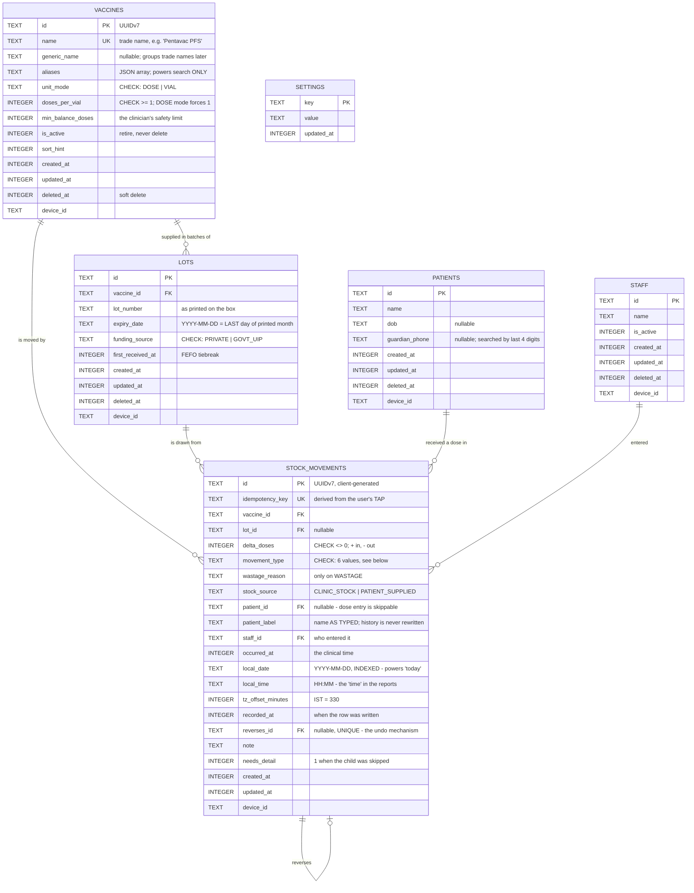
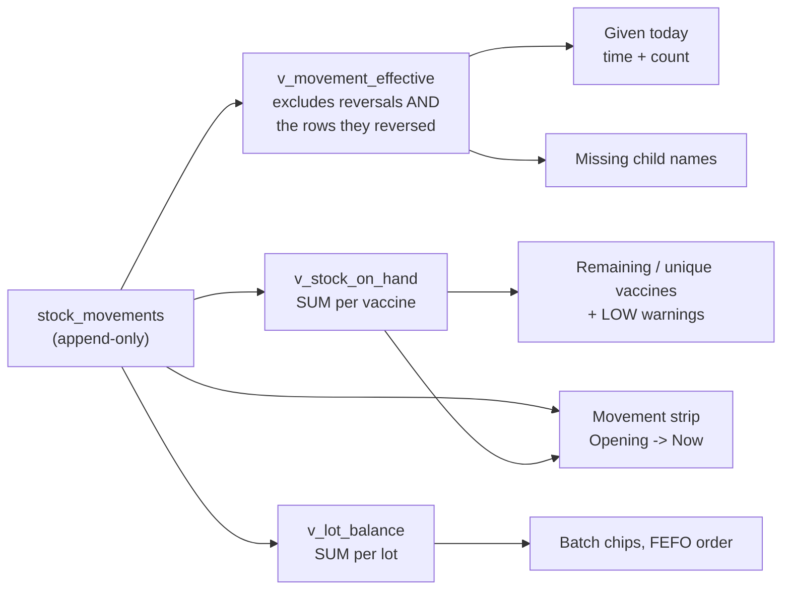

# Entity Relationship Diagram
## Clinic Vaccine Stock Logger — schema v1

Rendered by GitHub natively. The authoritative definition is
[`src/db/migrations/m001_initial.ts`](../src/db/migrations/m001_initial.ts); a flat snapshot lives in
[`schema.sql`](./schema.sql), regenerated with `npm run schema:dump`.

---

## 1. The model



`SETTINGS` is intentionally unrelated to everything else: it is a key/value store for
`device_id`, `clinic_name`, `last_backup_at`, `doses_since_backup`, `catalog_seeded` and
`last_daily_snapshot`.

---

## 2. Why the ledger looks like this

### 2.1 `stock_movements` is the only source of truth

There is **no** `current_stock` column anywhere. On-hand is `SUM(delta_doses)`.

A mutable stock integer is the paper notebook re-implemented in SQLite: it is precisely the artifact
that drifts away from the refrigerator, and once it has drifted there is no record of how. Deriving
the number instead means every change that produced it is still on file, attributable and reversible.

### 2.2 There is no `deleted_at` on `stock_movements`

Every other table has one. The ledger does not, deliberately — a soft delete on an audit trail is a
lie. The only way to undo anything is to append a `REVERSAL` row, and both rows survive forever.

### 2.3 Movement types and their sign

| Type | Sign | Meaning |
| --- | --- | --- |
| `OPENING_BALANCE` | `+` | One-time migration of the notebook's closing balance |
| `RECEIPT` | `+` | A delivery arrived |
| `ADMINISTRATION` | `−` | A dose was given to a child |
| `WASTAGE` | `−` | Breakage, expiry, open-vial timeout, cold chain, contamination |
| `ADJUSTMENT` | `±` | The result of a physical count disagreeing with the ledger |
| `REVERSAL` | `±` | The exact negation of one earlier movement |

The database enforces the sign with `CHECK` constraints, so a receipt cannot reduce stock and an
administration cannot increase it — regardless of what any future caller believes.

### 2.4 Immutability is enforced in the storage layer

```
trg_movements_immutable_arithmetic   BEFORE UPDATE OF (arithmetic columns) -> RAISE(ABORT)
trg_movements_no_delete              BEFORE DELETE                        -> RAISE(ABORT)
trg_movements_no_reversal_of_reversal BEFORE INSERT (guard)               -> RAISE(ABORT)
```

Not in application code. An agreement among developers not to mutate a ledger has a perfect
historical record of eventually being broken.

The split is deliberate and worth stating plainly: **the arithmetic is immutable, the annotations are
not.** `patient_id`, `patient_label`, `needs_detail` and `note` remain updatable so the clinician can
fill in a child's name at day end — that is completing a record, not rewriting one, and forcing it
through a reversal pair would add two rows that net to zero and obscure the history.

### 2.5 Identity is a foreign key, never a string

`vaccine_id` references `vaccines`. Catalog creation is unreachable from any data-entry screen. This
is what makes the clinician's request for "unique values" a property of the schema rather than a
report that de-duplicates: `BCG`, `B.C.G` and `BCG vaccine` cannot coexist because the second and
third can never be typed.

`aliases` exists so search stays generous while identity stays single — "penta", "dpt" and
"easyfive" all resolve to one row.

### 2.6 `local_date` is stored, not computed

Computing "today" at query time with `date('now','localtime')` depends on the phone's *current*
timezone and cannot be tested in CI. Stamping `local_date` and `local_time` once, at write time,
makes the daily reports an indexed equality test that is deterministic, and immune to the device
timezone changing afterwards.

### 2.7 `expiry_date` is the last day of the printed month

A vial printed `03/2027` is usable *through* March 2027. Storing `2027-03-01` would write off an
entire lot thirty days early, every time — real money and a real stock-out.

### 2.8 `funding_source` is part of lot identity

`UNIQUE (vaccine_id, lot_number, funding_source)`. Government (UIP) and privately purchased stock
must not commingle, so the same lot number from two sources is two lots.

### 2.9 Keys are chosen for a future the app does not have yet

UUIDv7 primary keys generated on the client, plus `updated_at` and soft deletes everywhere. Identity
and origin cannot be backfilled after the fact, so they are present from day one; sync bookkeeping
columns can be added with a trivial `ADD COLUMN`, so they are not.

The payoff, should a second device ever be needed: because the ledger is an append-only set of
immutable rows keyed by UUID, merging two devices is `INSERT OR IGNORE` and derived stock is correct
by construction.

---

## 3. Derived views — the read model



### The distinction that would otherwise become a bug

| Question | Source | Why |
| --- | --- | --- |
| **How much is left?** | the **raw** table | A reversal and its original cancel arithmetically. That is the entire reason reversing entries are the right design. |
| **How many were given today?** | `v_movement_effective` | Summing the raw table would report "3 given, 1 undone" as **3**. |

Getting these the wrong way round is the single most likely reporting error in the system, which is
why `reports.db.test.ts` asserts both directions explicitly.

### The movement strip

```
Opening 30 · +Received 20 · −Given 7 · −Wasted 3 · = 40 doses now
```

`opening` comes from the raw table for dates before today. The activity terms come from
`v_movement_effective` for today. `now` is read **directly** off the ledger rather than accumulated,
and `corrections` absorbs the residual:

```
corrections = now − (opening + received − given − wasted + adjusted)
```

That makes the derivation reconcile **by construction** — it cannot present a sum that does not add
up. The `corrections` term is not cosmetic: it is where a reversal booked today against a *previous
day's* movement shows up, since the original still sits inside `opening`. A 300-case property test
asserts the identity holds across randomly generated two-day histories.

---

## 4. Indexes

| Index | Purpose |
| --- | --- |
| `ux_vaccines_name` | Enforces one row per trade name — kills the misspelling failure mode |
| `ux_lots_identity` | One lot per (vaccine, lot number, funding source) |
| `ux_movements_reverses` | A movement can be reversed at most once |
| `ix_movements_local_date` | Daily reports stay fast as history grows |
| `ix_movements_vaccine`, `ix_movements_lot` | Balance roll-ups |
| `ix_movements_occurred` | Chronological history |
| `ix_movements_patient` | A child's vaccination history |
| `ix_movements_needs_detail` | Partial index over the small set of doses missing a name |
| `ix_patients_name`, `ix_patients_phone` | Type-ahead by name or last digits of the phone |
| `ix_lots_expiry` | Expiry warnings and first-expiry-first-out ordering |

Every unique index is partial on `WHERE deleted_at IS NULL`, so retiring a row frees its name for
reuse without ever deleting history.

---

## 5. Deliberately absent

A much larger model was designed and then cut, because the clinic confirmed it does not do these
things and unused tables are a maintenance cost with no offsetting benefit:

separate antigen/product tables · an explicit open-vial entity with a discard deadline ·
storage locations · cold-chain excursion events · lot quarantine · inter-branch and camp transfers ·
per-day balance snapshots · a materialised balance cache · cost, MRP, GST and HSN fields ·
stock-out events · scheduling and due-date tables.

Two hooks were kept because they cost one column each and their absence would later force a
migration of the whole ledger:

- **`stock_source`** — always `CLINIC_STOCK` today. If parents ever begin bringing their own
  purchased vials (very common in Indian private pediatrics), that becomes one enum value and one
  screen rather than a rewrite.
- **`generic_name`** — nullable today. Lets trade names be grouped by antigen later without
  re-deriving history.
