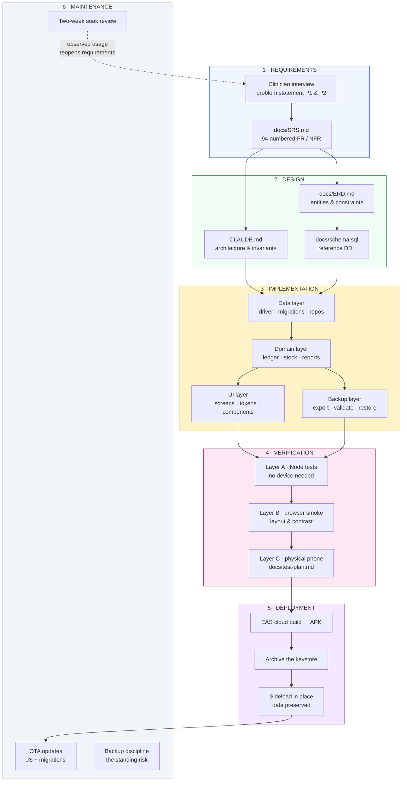
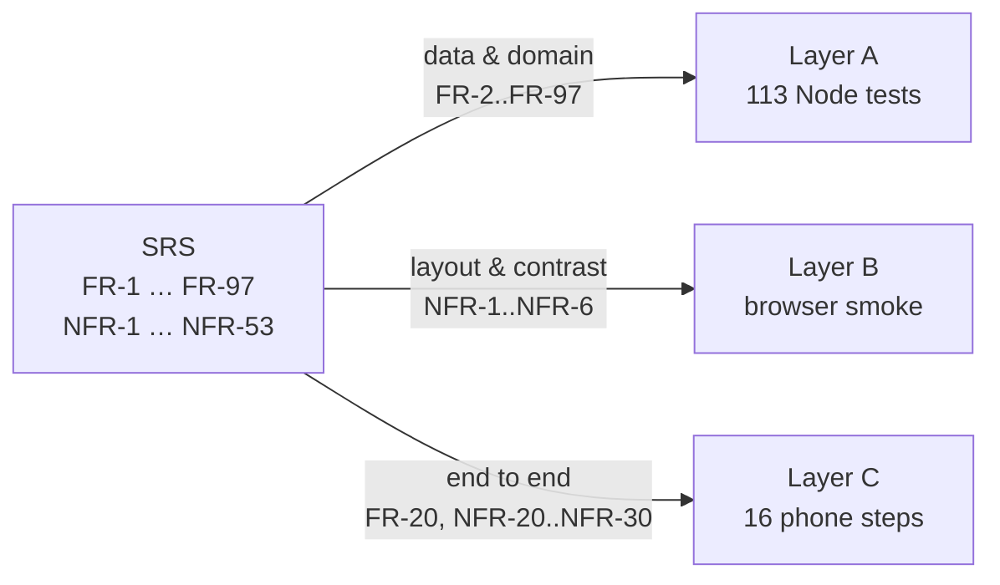
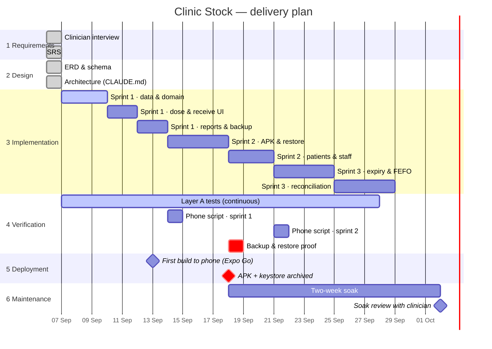

# Waterfall Model & Project Timeline
## Clinic Vaccine Stock Logger

---

## A note on methodology, stated honestly

**Waterfall and sprints are opposite models.** Waterfall is a sequence of phases, each signed off
before the next begins, with no iteration. Sprints are the opposite: short cycles that deliberately
revisit requirements, design and testing every time round.

Both are in this document because they answer different questions, and pretending they are the same
thing would be worse than saying so:

- The **waterfall diagrams** below document the SDLC as a phase-and-artifact structure — which
  document exists, what it depends on, and what "done" means for each phase. This is what the project
  documentation was asked for.
- The **sprint plan** is how the work actually gets executed and tracked in GitHub Milestones and
  Jira, because the highest project risk here is not a missed requirement, it is *the clinician
  abandoning the app for her notebook*. That risk can only be retired by putting a working build in
  her hands early and watching her use it — which is a feedback loop, not a phase gate.

Read the waterfall view as the **document map**, and the sprint view as the **schedule**.

---

## 1. Waterfall phases and artifacts

The dotted arrow back from Maintenance to Requirements is the one place this project knowingly
departs from strict waterfall, and it is deliberate: **watching the clinician use the app is the only
way to find out whether it actually beats the notebook.** No amount of up-front specification
substitutes for that.

## 2. Phase gates

| Phase | Entry condition | Deliverable | Exit condition ("done" means) |
| --- | --- | --- | --- |
| **1 Requirements** | Clinician has described the problem | `docs/SRS.md` | Every request in the clinician's own words maps to a numbered requirement (SRS §6) |
| **2 Design** | SRS approved | `docs/ERD.md`, `CLAUDE.md`, `docs/schema.sql` | Both failure modes P1 and P2 are addressed by a *structural* mechanism, not a procedural one |
| **3 Implementation** | Design approved | Working application | Clean `tsc --noEmit`; the app bundles for Android |
| **4 Verification** | Feature complete for the sprint | `docs/test-plan.md` results | All Layer A tests green; the 16-step phone script passes, in airplane mode |
| **5 Deployment** | Verification signed off | Installable APK | App runs on the clinician's own phone; **keystore archived off-machine** |
| **6 Maintenance** | In real use | Fixes, backups, review | A real backup file has been produced and successfully restored |

## 3. Verification traceability

Requirements are traced to their verification in [`SRS.md`](./SRS.md) §3–§4, where each `FR-n` and
`NFR-n` names the test file or test-plan step that proves it. As of schema v1 that is **113 automated
tests** across nine suites, all runnable with `npm test` and no device.

---

## 4. Schedule

### Milestones

| Date | Milestone | Why it matters |
| --- | --- | --- |
| **13 Sep** | v0.1 on the clinician's phone via Expo Go | First real feedback. Retires the abandonment risk (SRS R4) or exposes it early. |
| **18 Sep** | APK installed, **keystore archived** | The app survives without the developer's laptop. Losing the keystore later means uninstalling to update, which deletes the database (SRS R2). |
| **19 Sep** | A real backup produced *and restored* | Until a restore has actually been performed, the durability story is unproven (SRS R1). |
| **2 Oct** | Soak review | Decides whether Sprint 3's clinical depth is what she actually needs next. |

---

## 5. Sprint contents

| Sprint | Milestone | Contents |
| --- | --- | --- |
| **0** | Setup | SRS, ERD, waterfall, test plan, scaffold, repository, backlog |
| **1** | v0.1 — better than the notebook | Schema v1; `Db` driver and adapters; seeded catalog; Give Dose grid, dose modal and undo; Receive Stock; Stock tab with LOW badges; Given-today report; **backup export**; Layer A tests |
| **2** | Durability & delivery | EAS APK and keystore archive; restore with validate-before-commit; backup prompts and daily snapshots; patient register; batch chips from real stock; staff list; `funding_source` split; OTA updates |
| **3** | Clinical depth | Per-lot expiry warnings and first-expiry-first-out suggestion; open-vial tracking with discard window and wastage reasons; history report with date range and share-as-text; ledger corrections screen; blind physical-count reconciliation; missing-child-name queue |
| **Backlog** | If asked | Immunisation due-date reminders; multi-device merge; PIN lock; encryption at rest; iOS; cloud sync |

### What Sprint 1 deliberately cut, and why

- **A patient table.** A free-text label plus a recent-names list delivers most of the value at a
  fraction of the cost, and because the label is stored on the movement anyway, promoting it to a
  real register later is purely additive.
- **Expiry and first-expiry-first-out logic.** Record the expiry; do not act on it yet.
- **Restore.** Export alone protects against a lost phone. But export must not ship without restore
  for *long* — hence Sprint 2, and the 19 Sep milestone that proves it works.
- **Open-vial tracking with discard windows.** Genuinely useful clinically, but not what makes the
  app beat paper on day one.

**The Sprint 1 argument, stated plainly:** the notebook already provides a permanent record. What it
cannot do without manual counting is **arithmetic** — remaining stock, low-stock warnings, and the
day's total. v0.1 wins by deriving all three automatically. Everything after that is refinement of
something that already earns its place.
